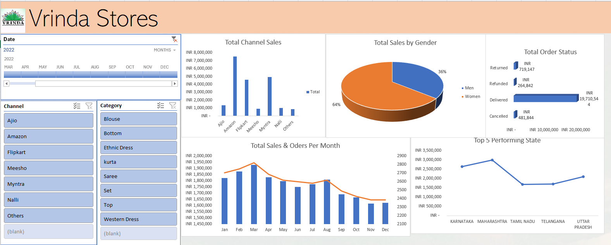

# Data Analytics Portfolio
# Project 1
**Title:** [Dash Ltd Sales Performance Dashboard 2023/2024](https://github.com/EkanVictor/EkanVictor.github.io)

**Tools Used:** Power BI (conditional formatting, power query editor, DAX)

**Description:** This project involved analysing the sales data of Dash Ltd to identify trends and pattern in sales performance for 2023/2024 financial year. The goal of the dashboard is to provide actional insight to improved the company sales strategy.

**Key Finding:**

**Dashboard Overview:** 

# Project 2
**Title:** [Vrinda Stores Sales Performance Dashboard 2022](https://github.com/EkanVictor/EkanVictor.github.io)

**Tools Used:** Microsoft Excel (Pivot table, pivot chart, slicer, timeline, vlookup)

**Description:** This project involved analysing the sales data of Vrinda Stores to identify trends and pattern in channel sales, gender sales, key performing state, percentage of delivered orders and cancelled orders in year 2022 financial year. The goal of the dashboard is to provide actional insight to improved the company sales strategy with regards to low performing channels and product category.

**Key Finding:** steady rise in sales in quarter 1 followed by steady drop in sales in quater 2 and quarter 4. Sales generated from only amazon channel are twice the ones generated from four other channels. Women are the largest customer base. Top 5 performing state were identified.

**Dashboard Overview:** 

